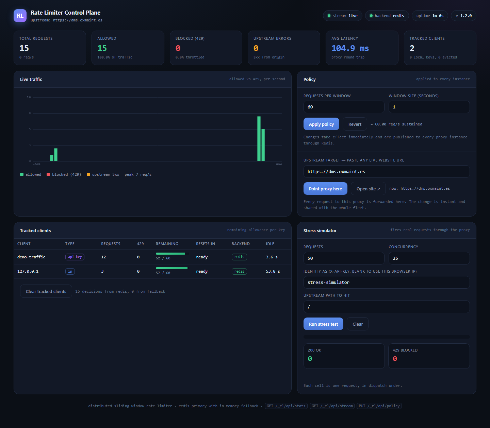

# Distributed Rate-Limiting Reverse Proxy

A production-shaped HTTP reverse proxy in Go that enforces a **sliding-window
rate limit** across a fleet of instances using Redis, and **degrades to a local
in-memory limiter** the moment Redis becomes slow or unreachable — so a Redis
outage costs you accuracy, never availability.

It ships with an embedded single-page admin dashboard: live traffic graph over
Server-Sent Events, a form that changes the policy across every instance at
once, a table of tracked clients with their remaining allowance, and a stress
simulator that fires real requests through the proxy and plots the 200 vs 429
split as it happens.

```
GET /                    ->  forwarded, with X-RateLimit-* headers
GET /   (over limit)     ->  429 + Retry-After + JSON explaining why
GET /_rl/dashboard       ->  the admin UI
GET /_rl/api/stream      ->  live metrics over SSE
PUT /_rl/api/policy      ->  change the limit fleet-wide, no restart
```

---

## Contents

- [Getting started](#getting-started)
- [Architecture](#architecture)
- [How the limiter decides](#how-the-limiter-decides)
- [Quick start](#quick-start)
- [Configuration](#configuration)
- [HTTP interface](#http-interface)
- [Admin dashboard](#admin-dashboard)
- [Deploying in front of your app](#deploying-in-front-of-your-app)
- [Testing](#testing)
- [Benchmarks](#benchmarks)
- [Repository layout](#repository-layout)
- [Design notes and limitations](#design-notes-and-limitations)

---

## Getting started

You run this in front of your own app: requests hit the proxy, it rate-limits
them, and forwards the survivors to your app. Here is the whole journey.

### Try it in 2 minutes (local, no real app needed)

```bash
git clone <this-repo> && cd ratelimit-proxy

# Redis + proxy, with the built-in mock app as the target
docker compose up --build           # no Docker? see "Without Docker" below

# open the dashboard
#   http://localhost:8080/_rl/dashboard
# send some traffic and watch it get limited
for i in $(seq 1 15); do curl -s -o /dev/null -w "%{http_code} " http://localhost:8080/; done
```

### Run it locally without Docker

No Docker or Redis installed? The repo ships an in-process Redis
(`cmd/devredis`) so nothing needs installing — you only need Go. Use **two
terminals**.

**Terminal 1 — the bundled Redis** (leave it running):

```bash
go run ./cmd/devredis          # listens on 127.0.0.1:6379
```

**Terminal 2 — the proxy:**

```bash
# bash / macOS / Linux
REDIS_ADDR=127.0.0.1:6379 \
PORT=8080 ADMIN_ADDR=127.0.0.1:9090 \
UPSTREAM_URL=mock://internal \
RATE_LIMIT_RPS=10 \
go run ./cmd/proxy
```

```powershell
# Windows PowerShell (set the vars, then run)
$env:REDIS_ADDR="127.0.0.1:6379"
$env:PORT="8080"; $env:ADMIN_ADDR="127.0.0.1:9090"
$env:UPSTREAM_URL="mock://internal"
$env:RATE_LIMIT_RPS="10"
go run ./cmd/proxy
```

Then:

- proxied traffic → <http://localhost:8080/>
- dashboard → <http://localhost:9090/dashboard>

Point it at your own local app instead of the mock by changing one value —
`UPSTREAM_URL=http://localhost:3000` (your dev server). Or skip Redis entirely
with `REDIS_ADDR=disabled` (each instance then limits on its own).

**Seeing the 429s.** A `for` loop of `curl` is too slow to trip the limit — the
window slides between requests. Use the dashboard's **stress simulator** (set
*Requests* to 40, press *Run stress test*), which fires them concurrently, or
any concurrent load tool.

**Gotcha on Windows:** `localhost` resolves to the IPv6 loopback `::1` while
`127.0.0.1` is IPv4, so the limiter treats them as two different clients, each
with its own budget. Pick one, or send an `X-API-Key` header so the identity is
stable:

```powershell
curl.exe -s -H "X-API-Key: me" http://localhost:8080/
```

### Put it in front of your own app (5 steps)

1. **Get it**
   ```bash
   git clone <this-repo> && cd ratelimit-proxy
   ```
2. **Point it at your app** — create `.env`:
   ```ini
   UPSTREAM_URL=http://localhost:3000     # your app's real origin (not the public domain)
   RATE_LIMIT_RPS=100
   WINDOW_SIZE_SECONDS=1
   ADMIN_ADDR=127.0.0.1:9090              # dashboard on a private port
   UPSTREAM_EDITABLE=false                # lock the target in production
   ```
3. **Run it** (on your server)
   ```bash
   UPSTREAM_URL=$UPSTREAM_URL docker compose -f docker-compose.deploy.yml up -d
   ```
   No Docker? Build the binary and run it under systemd — see
   [docs/DEPLOYMENT.md](docs/DEPLOYMENT.md).
4. **Send traffic through it** — point your domain's DNS (or load balancer) at
   the proxy host, once. See [Pointing your domain at it (DNS)](#pointing-your-domain-at-it-dns).
5. **Use it** — open `http://127.0.0.1:9090/dashboard` (from the server, or over
   an SSH tunnel) to watch live traffic, change the limit, and see per-client
   usage. Your app is now protected from request floods.

That is it — after step 4 it is permanent, with nothing to do per request. The
full production walkthrough (TLS, systemd, a fleet, hardening) is in
[docs/DEPLOYMENT.md](docs/DEPLOYMENT.md).

> A developer/ops tool, like nginx or Kong: whoever runs it needs a server and
> either Docker or Go. It is not a hosted service — you deploy it yourself, and
> nobody else is ever in your request path.

---

## Architecture

```
   clients                             ┌────────────────────────────────┐
   ───────                             │  admin dashboard (embedded)    │
   curl / browsers / services          │  GET /dashboard                │
        │                              │   ├─ SSE    GET /api/stream    │
        │                              │   ├─ form   PUT /api/policy    │
        │                              │   └─ table  GET /api/clients   │
        │                              └───────────────▲────────────────┘
        │                                              │
        ▼                                              │
 ┌──────────────────────────────────────────────────── │ ──────────────┐
 │ proxy process                                       │               │
 │                                                     │               │
 │  ┌──────────────┐   ┌───────────────┐   ┌───────────┴───────────┐   │
 │  │  identify    │──▶│   limiter     │──▶│  metrics collector    │   │
 │  │  X-API-Key   │   │   Manager     │   │  1s ring buffer + hub │   │
 │  │  or peer IP  │   └───────┬───────┘   └───────────────────────┘   │
 │  └──────────────┘           │                                       │
 │                    allowed? │                                       │
 │              ┌──────────────┴──────────────┐                        │
 │              ▼ yes                         ▼ no                     │
 │    ┌──────────────────┐          ┌───────────────────────┐          │
 │    │  reverse proxy   │          │  429 + Retry-After    │          │
 │    │  httputil.RP     │          │  JSON payload         │          │
 │    └────────┬─────────┘          └───────────────────────┘          │
 └─────────────┼───────────────────────────────────────────────────────┘
               ▼
        upstream origin
   (built-in mock, or any http/https URL)


   Every instance shares one limit through Redis:

   ┌───────────┐   ┌───────────┐   ┌───────────┐
   │ proxy A   │   │ proxy B   │   │ proxy C   │
   └─────┬─────┘   └─────┬─────┘   └─────┬─────┘
         └───────────────┼───────────────┘
                         ▼
                  ┌─────────────┐
                  │    Redis    │  sorted set per client key
                  │  rl:<kind>: │  + pub/sub for policy changes
                  │   <client>  │
                  └─────────────┘
```

## How the limiter decides

Each client key owns a Redis sorted set holding one member per request, scored
by arrival time in milliseconds. A request is admitted by a single Lua script so
the read and the write cannot interleave:

```
   Manager.Allow(key)
         │
         ├── circuit open? ──yes────────────────────────────────────┐
         │                                                          │
         no                                                         │
         ▼                                                          │
   ┌──────────────────────────────────────┐                         │
   │ EVALSHA, capped at REDIS_TIMEOUT      │                        │
   │   ZREMRANGEBYSCORE key -inf now-W     │  drop what slid out    │
   │   ZCARD key                           │  how many are left     │
   │   ZADD key now member  (if under)     │  admit                 │
   │   PEXPIRE key W                       │  self-cleaning         │
   │   ZRANGE key 0 0 WITHSCORES           │  when a slot frees     │
   └────────┬─────────────────────┬────────┘                        │
         ok │                     │ error or timeout                │
            ▼                     ▼                                 ▼
      decision from Redis    failures++ ──▶ threshold ──▶ circuit opens
                                                                    │
                                                                    ▼
                                             sync.Map sliding-window log
                                             (per process, still enforced)
```

Why a Lua script rather than a pipeline: under concurrency, a read-then-write
implementation lets more than the limit through, because every racing request
sees the same pre-write count. `TestRedisLimiterIsAtomicUnderConcurrency` fires
200 simultaneous requests at a limit of 25 and asserts that exactly 25 pass.

**The fallback.** Every Redis call is bounded by `REDIS_TIMEOUT` (200 ms by
default). On failure the request is answered by an in-process sliding-window log
kept in a `sync.Map`, one mutex-guarded entry per client key, with a janitor
goroutine evicting keys idle for longer than twice their window so a churning
key space cannot leak memory. After `FAILURE_THRESHOLD` consecutive failures a
circuit breaker opens and Redis is skipped entirely, so an outage does not add
the timeout to every request. A background prober closes the circuit within
`PROBE_INTERVAL` of Redis coming back, without waiting for user traffic.

While the circuit is open each instance enforces the limit on its own, so a
fleet of N instances admits up to N times the configured rate. That is the
deliberate trade: approximate limiting beats refusing traffic or letting it
through unmetered.

---

## Quick start

### Docker Compose (Redis included)

```bash
docker compose up --build
```

Then:

- dashboard  <http://localhost:8080/_rl/dashboard>
- proxied traffic `curl -i http://localhost:8080/anything`
- health `curl http://localhost:8080/_rl/healthz`

Two instances behind one Redis, to see a single global limit in action:

```bash
docker compose --profile cluster up --build
# instance A: http://localhost:8080/_rl/dashboard
# instance B: http://localhost:8081/_rl/dashboard
```

Forward to a real origin instead of the built-in mock:

```bash
docker compose --profile httpbin up --build   # go-httpbin on :8090
UPSTREAM_URL=http://httpbin:8080/anything docker compose up --build
# or straight to the internet:
UPSTREAM_URL=https://httpbin.org/anything docker compose up --build
```

### Without Docker

The proxy runs happily with no Redis at all — the in-memory limiter carries the
whole load, and every instance then limits independently:

```bash
REDIS_ADDR=disabled RATE_LIMIT_RPS=5 go run ./cmd/proxy
```

To exercise the **Redis path without installing anything**, `cmd/devredis`
serves the real Redis protocol from an in-process
[miniredis](https://github.com/alicebob/miniredis) — the same server the tests
use. In one terminal:

```bash
make devredis          # or: go run ./cmd/devredis
```

and in another:

```bash
make dev               # or: REDIS_ADDR=127.0.0.1:6379 go run ./cmd/proxy
```

`/healthz` should now report `"backend":"redis"`. It is a development aid, not a
Redis replacement: nothing is persisted and its Lua interpreter is far slower
than the real thing, so use a real Redis for anything you intend to measure or
ship.

With a Redis you installed yourself:

```bash
REDIS_ADDR=localhost:6379 go run ./cmd/proxy
```

On Windows PowerShell, set the variables first:

```powershell
$env:REDIS_ADDR = "127.0.0.1:6379"; $env:RATE_LIMIT_RPS = "5"
go run ./cmd/proxy
```

`make help` lists every target (`build`, `test`, `bench`, `up`, `load`, ...).

### See it throttle

```bash
for i in $(seq 1 15); do
  curl -s -o /dev/null -w "%{http_code} " -H "X-API-Key: demo" http://localhost:8080/
done
# 200 200 200 200 200 200 200 200 200 200 429 429 429 429 429
```

On **Windows PowerShell 5.1**, `curl.exe` (shipped with Windows 10 and later) is
the least fiddly way to see the status codes:

```powershell
1..15 | ForEach-Object { curl.exe -s -o NUL -w "%{http_code}`n" http://localhost:8080/ }
```

`Invoke-WebRequest` throws on a 429 rather than returning it, and the
`-SkipHttpErrorCheck` switch that suppresses that only exists in PowerShell 7,
so on 5.1 catch it explicitly:

```powershell
1..15 | ForEach-Object {
  $i = $_
  try   { "$i : " + (Invoke-WebRequest "http://localhost:8080/" -UseBasicParsing).StatusCode }
  catch { "$i : " + $_.Exception.Response.StatusCode.value__ }
}
```

To read the headers back:

```powershell
$r = Invoke-WebRequest "http://localhost:8080/" -UseBasicParsing
$r.Headers.GetEnumerator() | Where-Object { $_.Key -like "X-RateLimit*" }
```

> **`localhost` and `127.0.0.1` are different clients.** On Windows `localhost`
> resolves to the IPv6 loopback `::1`, so those two URLs land in separate
> buckets and each gets its own budget. Pick one, or send an `X-API-Key` so the
> identity does not depend on which address the client picked.

---

## Configuration

Everything is read from the environment, and every value has a working default —
the binary starts with no configuration at all. See `.env.example`.

| Variable | Default | Meaning |
| --- | --- | --- |
| `PORT` | `8080` | Listen port |
| `RATE_LIMIT_RPS` | `10` | Requests allowed **inside one window** |
| `WINDOW_SIZE_SECONDS` | `1` | Width of the sliding window |
| `REDIS_ADDR` | `localhost:6379` | Redis address, or `disabled` for memory-only |
| `REDIS_PASSWORD` | *(empty)* | Redis auth |
| `REDIS_DB` | `0` | Redis database index |
| `REDIS_PREFIX` | `rl:` | Key prefix for limiter and policy keys |
| `REDIS_TIMEOUT` | `200ms` | Per-call budget before failing over |
| `FAILURE_THRESHOLD` | `3` | Consecutive Redis failures that open the circuit |
| `FALLBACK_COOLDOWN` | `5s` | How long the circuit stays open |
| `PROBE_INTERVAL` | `2s` | Background Redis health check |
| `CLEANUP_INTERVAL` | `30s` | In-memory limiter TTL sweep |
| `UPSTREAM_URL` | `mock://internal` | Origin to forward to, or the built-in mock |
| `UPSTREAM_TIMEOUT` | `30s` | Upstream response header timeout |
| `TRUST_PROXY_HEADERS` | `false` | Honour `X-Forwarded-For` / `X-Real-IP` |
| `UPSTREAM_EDITABLE` | `true` | Allow changing the target at runtime from the dashboard |
| `DASHBOARD_ENABLED` | `true` | Serve the dashboard |
| `ADMIN_PREFIX` | `/_rl` | Namespaces every control-plane route (see below) |
| `ADMIN_ADDR` | *(empty)* | Bind the dashboard + API to their own address (e.g. `127.0.0.1:9090`); recommended in production |
| `METRICS_WINDOW_SECONDS` | `60` | Seconds of history in the live graph |
| `LOG_LEVEL` / `LOG_FORMAT` | `info` / `text` | `debug/info/warn/error`, `text/json` |
| `SHUTDOWN_TIMEOUT` | `10s` | Grace period for draining connections |

Durations accept Go syntax (`200ms`, `1m30s`) or a bare number of seconds (`45`).

**On `RATE_LIMIT_RPS`.** It is the number of requests allowed per window. With
the default one-second window that is literally requests per second; with a
30-second window, `RATE_LIMIT_RPS=250` means 250 requests per 30 s, a sustained
8.33 req/s. The API reports both as `rps` and `effective_rps`.

**On `TRUST_PROXY_HEADERS`.** Leave it off unless the proxy sits behind a load
balancer you control. When it is on, any client can send `X-Forwarded-For` and
pick its own bucket, which defeats IP-based limiting entirely.

---

## HTTP interface

### Headers on every proxied response

| Header | Example | Meaning |
| --- | --- | --- |
| `X-RateLimit-Limit` | `10` | Requests permitted per window |
| `X-RateLimit-Remaining` | `7` | Requests still available right now |
| `X-RateLimit-Reset` | `1788955441` | Unix seconds when a slot frees up |
| `X-RateLimit-Window` | `1` | Window width in seconds |
| `X-RateLimit-Policy` | `10;w=1` | Limit and window, combined |
| `X-RateLimit-Backend` | `redis` | Which limiter decided: `redis` or `memory` |
| `Retry-After` | `1` | Seconds to wait (429 responses only) |

### 429 response body

```json
{
  "error": "rate_limit_exceeded",
  "message": "rate limit of 10 requests per 1s exceeded",
  "limit": 10,
  "remaining": 0,
  "window_seconds": 1,
  "retry_after_seconds": 1,
  "reset_at": "2026-09-09T12:04:10.658Z",
  "client": "api_key:demo",
  "backend": "redis",
  "path": "/orders"
}
```

### Pointing at a real website

`UPSTREAM_URL` accepts any http or https origin, so the proxy can sit in front of
an application you already run:

```bash
UPSTREAM_URL=https://your-site.example go run ./cmd/proxy
```

Everything else keeps working unchanged: the sliding window, the headers, the
429s, the fallback and the dashboard.

**Or change it live from the dashboard.** Under *Policy* there is an *Upstream
target* box: paste any live website URL, press *Point proxy here*, and every
subsequent request is forwarded there — no restart. The change is persisted to
Redis and published to every instance in the fleet, and *Open site* opens the
proxied site in a new tab. The endpoint is `PUT {prefix}/api/upstream`
(`{"url":"https://example.com"}`); the same validation as startup applies, so
only `http`, `https` and the `mock://internal` sentinel are accepted.

This is an SSRF / open-relay lever: anyone who can reach the dashboard can point
the proxy at any address the server can reach, including internal ones. It is on
by default because the dashboard is meant to be run behind your own network;
set `UPSTREAM_EDITABLE=false` to lock the target to `UPSTREAM_URL` and have the
endpoint return 403.

**This is why `ADMIN_PREFIX` exists.** The control plane and the proxied traffic
share one listener, so any path the proxy claims is a path the upstream can never
serve. Mounted at the root, `/api/*` and `/dashboard` are exactly the paths a
real application is most likely to own — verified against a live Next.js app,
where `/api/health` returned the proxy health JSON instead of the site's, and
`/api/users` returned the proxy 404 instead of the page. Namespacing the control
plane under `/_rl` reduces the collision surface to a single segment no
framework generates.

Rules the prefix must satisfy, all enforced at startup:

- it is a literal path — `{`, `}`, `?`, `#`, `..`, whitespace and `//` are
  rejected. Braces matter most: Go 1.22 mux patterns read `{name}` as a
  wildcard, so `ADMIN_PREFIX=/{tenant}` would register `GET /{tenant}/api/stats`
  and swallow `/customers/api/stats` from the upstream — a wider hijack than the
  bug the prefix exists to prevent.
- it must not contain `/dashboard`, which would confuse the base-path
  derivation the embedded page uses.
- a missing leading slash is added rather than rejected: `ADMIN_PREFIX=_rl`
  would otherwise register as a *host* pattern and answer only for `Host: _rl`,
  making the control plane silently invisible.

Setting `ADMIN_PREFIX=` (empty) restores the root mounts. Only do that when the
upstream owns no `/api` or `/dashboard` of its own — the startup log says so
explicitly when you do.

### Client identity

`X-API-Key` wins when present; otherwise the peer IP is used (or the forwarded
address when `TRUST_PROXY_HEADERS=true`). The two live in separate namespaces,
so an API key that looks like an address cannot share a bucket with the real
client at that address. Keys are stripped of control characters and truncated to
128 bytes so a hostile caller cannot inflate the Redis key space.

### Control plane

Every route the proxy owns lives under `ADMIN_PREFIX` (default `/_rl`), written
as `{prefix}` below. Everything else is proxied traffic.

| Method and path | Purpose |
| --- | --- |
| `GET {prefix}/healthz`, `GET {prefix}/api/health` | Liveness, plus which backend is active |
| `GET {prefix}/readyz` | Readiness |
| `GET {prefix}/api/stats` | Full metrics snapshot (totals, 60 s series, clients) |
| `GET {prefix}/api/stream` | The same snapshot pushed once a second over SSE |
| `GET {prefix}/api/policy` | Current limit |
| `PUT` or `POST {prefix}/api/policy` | Change the limit; JSON or form encoded |
| `GET {prefix}/api/clients` | Tracked clients, plus the fleet-wide view from Redis |
| `POST {prefix}/api/clients/reset` | Clear tracked clients and the Redis limiter keys |

```bash
# raise the limit across every instance, no restart
curl -X PUT -H 'Content-Type: application/json' \
     -d '{"rps":100,"window_seconds":10}' \
     http://localhost:8080/_rl/api/policy
```

The health endpoint stays `200` while Redis is down: the proxy is still serving
correctly, just from the fallback. `degraded` and `backend` in the body are what
you alert on.

---

## Admin dashboard



*Captured live: a 12 requests-per-second policy applied from the form, then the
simulator firing 50 requests through the proxy — 12 allowed, 38 throttled.*

`GET /_rl/dashboard` — one self-contained HTML page compiled into the binary with
`go:embed`. No CDN, no build step, no external fetches, so it works in an
air-gapped deployment and runs under a strict `Content-Security-Policy`.

- **Live traffic graph.** A stacked per-second bar chart of allowed vs 429 vs
  upstream 5xx over the last 60 seconds, driven by SSE. One snapshot is
  serialised per tick and fanned out to every connected dashboard; a browser tab
  that cannot keep up drops frames instead of stalling the broadcaster.
- **Policy form.** Edit requests-per-window and window size, press Apply. The
  change takes effect on the next request, is persisted to Redis, and is
  published to every other instance over pub/sub. Typing in the form suppresses
  live overwrites until you apply or revert.
- **Client table.** Every tracked IP and API key with request counts, 429 count,
  a remaining-allowance bar, time to reset, and which backend served it.
- **Stress simulator.** Fires N real requests (default 50) through the proxy at a
  chosen concurrency, under a dedicated `X-API-Key` so it does not consume your
  own budget. Each request appears as a cell that turns green on 200 and red on
  429 as it lands, above a running 200/429 split.

Control-plane and dashboard routes are never rate limited or proxied; only
unmatched paths are treated as traffic.

---

## Deploying in front of your app

The production model is **self-hosted**: you put this proxy in front of your own
application, and every request is protected from then on — no third party in the
path. The mental model and the exact steps (Docker Compose, a systemd unit, TLS
with Caddy/nginx, DNS, and a fleet sharing one Redis) are in
**[docs/DEPLOYMENT.md](docs/DEPLOYMENT.md)**.

Two settings make a deployment safe:

- **`ADMIN_ADDR`** binds the dashboard and control API to their own address, so
  the public port serves *only* proxied traffic. The unauthenticated dashboard
  is never exposed to the internet:

  ```bash
  PORT=8080 ADMIN_ADDR=127.0.0.1:9090 UPSTREAM_URL=http://your-app:3000 UPSTREAM_EDITABLE=false ./proxy
  # public traffic:  http://<host>:8080/
  # dashboard:       http://127.0.0.1:9090/dashboard   (host only)
  ```

- **`UPSTREAM_EDITABLE=false`** locks the target to `UPSTREAM_URL`, so the
  runtime "change upstream" endpoint returns 403.

There is a ready-made `docker-compose.deploy.yml` wired exactly this way.

> This is an application-layer rate limiter, not a full anti-DDoS service. It
> stops request floods and enforces per-client limits; a volumetric network
> flood still needs a CDN/scrubbing layer upstream. See DEPLOYMENT.md §Scope.

### Pointing your domain at it (DNS)

DNS is **not** set inside this app — it lives at whoever manages your domain
(Cloudflare, your registrar). You point it once, by hand, and every visitor is
protected from then on. You need a **server with a public IP** running the proxy
(a home laptop on `localhost` cannot receive a domain's traffic).

1. Get the server's public IP: `curl -s https://ifconfig.me` (on the server).
2. In your DNS provider's dashboard, add an **`A` record**:
   `Name` = `@` (root) or a subdomain like `dms`, `Value` = the server IP.
3. Save; check with `nslookup dms.oxmaint.es` (should return your IP).
4. On **Cloudflare** it is DNS → Add record → Type `A`; the orange-cloud toggle
   decides whether traffic also passes through Cloudflare first.

**The one trap — don't loop:** once the domain points at the proxy, set
`UPSTREAM_URL` to the app's *real origin*, never back to the public domain:

```
WRONG:  dms.oxmaint.es → proxy → https://dms.oxmaint.es   (infinite loop)
RIGHT:  dms.oxmaint.es → proxy → http://10.0.0.5:3000      (the app's origin)
```

**Testing locally needs no DNS** — use `localhost`, or add `127.0.0.1 myapp.local`
to your hosts file for a domain-like URL. Full step-by-step, including TLS and
Cloudflare specifics, is in **[docs/DEPLOYMENT.md](docs/DEPLOYMENT.md)**.

---

## Testing

```bash
make test          # everything
make test-verbose  # with per-test output
make cover         # coverage.html
make bench         # benchmarks
```

The Redis-backed paths run on every `go test` invocation against an in-process
[miniredis](https://github.com/alicebob/miniredis), which executes the same Lua
script and sorted-set commands, so nothing important is skipped by default. To
run the same tests against a real server:

```bash
make test-redis                        # defaults to localhost:6379
TEST_REDIS_ADDR=redis:6379 go test ./internal/limiter/ -v
```

What is covered:

| Area | Tests |
| --- | --- |
| Normal forwarding | Method, path, query and headers reach the origin; upstream response headers pass back; `X-Forwarded-For` is added |
| 429 threshold | Exactly `limit` requests pass, the rest get 429 with the documented JSON body and `Retry-After`, and throttled traffic never reaches the origin |
| Redis fallback | With Redis unreachable the proxy keeps serving, reports `X-RateLimit-Backend: memory`, and the fallback still enforces the limit |
| Circuit breaker | Opens after the threshold, short-circuits later calls in under 20 ms, and a cancelled caller does not trip it |
| Atomicity | 200 concurrent requests against a limit of 25 admit exactly 25, on both backends |
| Sliding window | A slot frees exactly one window after the request that took it, not on a fixed boundary |
| Memory hygiene | The janitor evicts idle keys, and an evicted key starts over cleanly |
| Client identity | API key vs IP precedence, IPv6, forwarded headers trusted and untrusted, control-character stripping, length capping |
| Control plane | Stats, policy get/put/form, validation rejections leave the policy untouched, client table, reset |
| SSE | The stream sends a snapshot immediately and keeps pushing new traffic |
| Dashboard | Served at both paths, references every endpoint it uses, has no external dependencies, sets its security headers |
| Config | Defaults, env parsing, duration forms, validation, secret redaction |
| Panics | A panicking handler becomes a logged 500 and the server keeps serving |

The race detector needs a C toolchain, which is not always present on Windows:

```bash
make test-race     # CGO_ENABLED=1 go test ./... -race
```

### Load script

`scripts/test_load.sh` drives a running proxy with `curl` and checks the
threshold, so you can verify a real deployment rather than a test harness:

```bash
./scripts/test_load.sh
REQUESTS=500 CONCURRENCY=50 API_KEY=tenant-a ./scripts/test_load.sh
TARGET=http://localhost:8080/anything ./scripts/test_load.sh
```

```
status distribution
  200      82   68.3%  ##################################                 OK
  429      38   31.7%  ###############                                    THROTTLED

latency
  mean    2.72 ms
  p50     2.44 ms
  p95     4.69 ms
  p99     5.54 ms

summary
  wall clock             4.478 s
  allowed (200)          82
  throttled (429)        38
  policy limit           20 per 1s

PASS  82 allowed and 38 throttled, within the 20/1s policy (ceiling 110)
```

It reads the live policy from `{prefix}/api/policy` and fails if more requests were
admitted than the elapsed time can justify, so it is usable as a smoke test in
CI.

---

## Benchmarks

Measured on the development machine: Windows 11, Intel i3-1125G4 (4 cores /
8 threads, 2.0 GHz), Go 1.26.2. **The load generator runs on the same box as the
proxy**, so client and server compete for the same CPUs — treat these as a floor,
not a ceiling.

### Go benchmarks

`go test ./internal/proxy/ -bench . -benchmem -benchtime 2s`

| Benchmark | ns/op | B/op | allocs/op | Notes |
| --- | --- | --- | --- | --- |
| `BenchmarkLimiterMemory` | 209.6 | 83 | 2 | Fallback decision, single hot key |
| `BenchmarkLimiterMemoryManyKeys` | 168.2 | 116 | 3 | Fallback across a wide key space |
| `BenchmarkLimiterRedis` | 1 806 296 | 558 796 | 894 | See the caveat below |
| `BenchmarkProxyAllowed` | 54 414 | 49 625 | 205 | Full HTTP round trip through the proxy to an origin |
| `BenchmarkProxyThrottled` | 19 022 | 10 452 | 160 | Full HTTP round trip rejected with 429 |

The in-memory limiter costs about **0.2 microseconds** per decision, which is
noise next to the ~50 microseconds an end-to-end HTTP round trip takes on this
hardware. Rejecting costs roughly a third of forwarding, because nothing leaves
the process.

> **Caveat on `BenchmarkLimiterRedis`.** These runs use an in-process
> [miniredis](https://github.com/alicebob/miniredis) so the suite needs no
> external server. Its Lua interpreter is single threaded and serialises under
> 8-way parallelism, which is what the 1.8 ms figure measures — miniredis, not
> Redis. A real Redis on localhost answers this script in the tens of
> microseconds. Point `TEST_REDIS_ADDR` at a real server for a meaningful number.

### End-to-end throughput

A Go load generator with keep-alive, 64 concurrent workers, against the running
binary over loopback:

| Scenario | Requests | Wall | Throughput | p50 | p95 | p99 |
| --- | --- | --- | --- | --- | --- | --- |
| In-memory limiter, all allowed | 50 000 | 1.24 s | **40 235 req/s** | 1.04 ms | 4.30 ms | 6.46 ms |
| In-memory limiter, all rejected | 50 000 | 1.25 s | **39 955 req/s** | 1.09 ms | 4.44 ms | 6.25 ms |
| Redis limiter (miniredis) | 20 000 | 12.59 s | 1 586 req/s | 40.7 ms | 46.5 ms | 53.6 ms |

### Threshold accuracy

With `RATE_LIMIT_RPS=1` and a one-hour window, 50 000 requests at concurrency 64
produced **exactly one 200 and 49 983 429s, zero failures**. The limit holds
under real concurrency, not just in the unit tests.

The dashboard simulator, at a 10 requests-per-second policy, fires 50 requests
in 0.07 s and reports 10 allowed and 40 throttled — the shape you expect from a
sliding window that has not yet had time to slide.

And with two instances sharing one Redis, alternating eight requests for the
same API key between them under a limit of 6 admitted **exactly 6 in total**:
one global limit, not one per process.

---

## Repository layout

```
.
├── cmd/
│   ├── proxy/main.go          wiring, signals, graceful shutdown
│   └── devredis/main.go       in-process Redis for local dev, no install
├── config/
│   ├── config.go              environment loading and validation
│   └── config_test.go
├── internal/
│   ├── limiter/
│   │   ├── limiter.go         Policy, Decision, the Limiter interface
│   │   ├── redis.go           sliding window in Lua over a sorted set
│   │   ├── memory.go          sync.Map fallback with a TTL janitor
│   │   ├── manager.go         failover and the circuit breaker
│   │   └── policystore.go     policy shared across instances via Redis
│   ├── proxy/
│   │   ├── proxy.go           the rate-limiting handler and panic recovery
│   │   ├── client.go          API key and IP identification
│   │   ├── upstream.go        reverse proxy and the built-in mock origin
│   │   └── bench_test.go      benchmarks
│   ├── metrics/
│   │   ├── metrics.go         counters, per-second ring buffer, client table
│   │   └── hub.go             SSE fan-out
│   ├── api/
│   │   ├── api.go             stats, health, policy, clients
│   │   └── sse.go             the live stream and its broadcaster
│   └── dashboard/
│       ├── dashboard.go       go:embed and security headers
│       └── static/index.html  the single-page admin UI
├── scripts/test_load.sh       load and threshold check against a live proxy
├── docker-compose.yml         redis + proxy, with cluster and httpbin profiles
├── Dockerfile                 static build, non-root runtime, healthcheck
├── Makefile
└── .env.example
```

---

## Design notes and limitations

**Availability over accuracy, deliberately.** When Redis is unreachable each
instance limits on its own, so a fleet of N instances can admit up to N times the
configured rate until Redis returns. The alternative — failing requests closed —
turns a Redis blip into an outage. `X-RateLimit-Backend` and the `degraded` flag
make the state observable so you can alert on it.

**Memory is bounded on both sides.** The fallback keeps one timestamp per
in-window request per key, so memory per key is capped by the limit itself, and
idle keys are evicted after twice their window. In Redis each key carries a
`PEXPIRE` equal to the window, so nothing outlives its usefulness even if a
client never returns. The dashboard client table is capped at 500 keys, evicting
the least recently seen.

**Cost of a long window with a high limit.** The sorted set holds one member per
request in flight, so `RATE_LIMIT_RPS=100000` over an hour is a large key. For
that shape, a two-bucket approximate counter would be the right trade; the exact
log used here is chosen because it is precise at the request-per-second scale
this proxy targets.

**One global policy.** Per-client and per-route policies are not implemented —
`Policy` is a value passed into every call and `Manager.AllowPolicy` already
takes an override, so adding a policy resolver is a contained change.

**`X-RateLimit-Reset` is a Unix timestamp**, following the GitHub convention,
not the delta-seconds of the IETF draft. `Retry-After` carries the delta on 429
responses, so both readings are available.

**Response caching is not part of this service.** Despite the directory name,
what is implemented is the rate-limiting reverse proxy specified for this task;
no response cache sits in front of the upstream.

**Server write timeouts must stay off** for the SSE endpoint to work. The
default configuration sets `WRITE_TIMEOUT=0` and the stream handler clears both
deadlines through `http.ResponseController`; changing that will cut dashboards
off after the timeout.

**The dashboard has no authentication.** It can change the rate limit for the
whole fleet, so do not expose `{prefix}/dashboard` or `{prefix}/api/` to the internet. Put them
behind your ingress auth, or run with `DASHBOARD_ENABLED=false` and drive the
control plane from inside your network.
